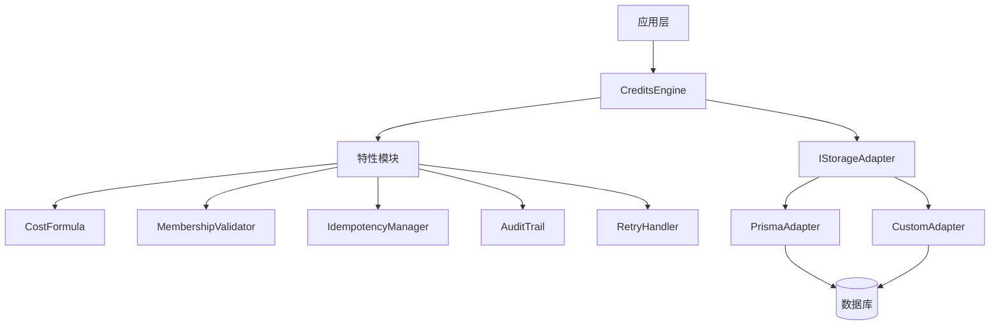
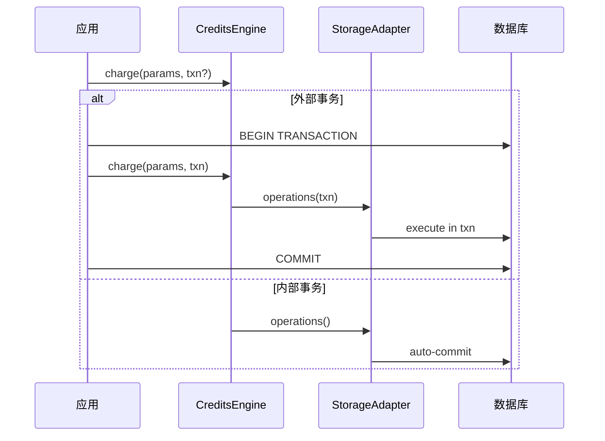
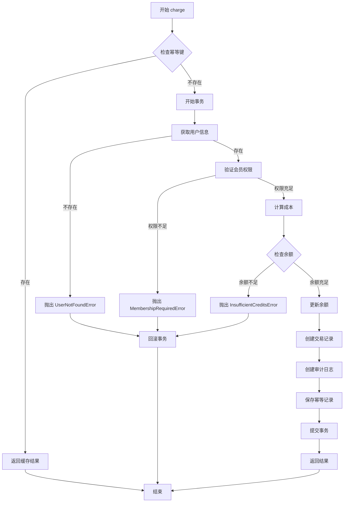
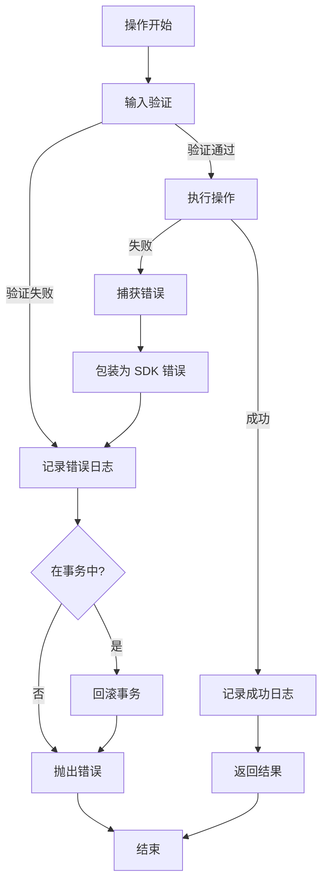

# 设计文档

## 概述

credit-sdk 是一个通用的 SaaS 积分系统 SDK，采用适配器优先的架构设计，实现存储层解耦、事务感知和高可靠性。SDK 的核心设计理念是：

1. **去 ORM 化**: 核心不依赖任何特定的 ORM 或数据库库
2. **适配器模式**: 所有存储操作通过 `IStorageAdapter` 接口抽象
3. **事务透传**: 支持将 SDK 操作嵌入到更大的业务事务中
4. **参考实现**: 提供 `PrismaAdapter` 作为最佳实践示例

SDK 提供完整的积分管理功能，包括扣费、退款、发放、查询和权限验证，同时内置幂等性、重试、审计日志等企业级特性。

## 架构

### 整体架构



### 分层设计

1. **核心层 (core/)**
   - `CreditsEngine`: 主要服务类，协调所有操作
   - `types.ts`: 类型定义
   - `errors.ts`: 错误类定义

2. **适配器层 (adapters/)**
   - `IStorageAdapter`: 存储接口定义
   - `PrismaAdapter`: Prisma 参考实现
   - 用户可实现自定义适配器

3. **特性层 (features/)**
   - 独立的功能模块，可组合使用
   - 每个模块负责单一职责

4. **配置层 (config/)**
   - 集成示例和配置模板

### 事务处理流程



## 组件和接口

### IStorageAdapter 接口

存储适配器是 SDK 与数据库交互的唯一接口：

```typescript
interface IStorageAdapter {
  /**
   * 根据用户 ID 获取用户信息
   * @param userId - 用户 ID
   * @param txn - 可选的事务上下文
   */
  getUserById(userId: string, txn?: any): Promise<User | null>;
  
  /**
   * 更新用户积分余额
   * @param userId - 用户 ID
   * @param amount - 变更金额（正数为增加，负数为减少）
   * @param txn - 可选的事务上下文
   */
  updateUserCredits(userId: string, amount: number, txn?: any): Promise<User>;
  
  /**
   * 创建交易记录
   * @param transaction - 交易数据
   * @param txn - 可选的事务上下文
   */
  createTransaction(transaction: TransactionInput, txn?: any): Promise<Transaction>;
  
  /**
   * 创建审计日志
   * @param log - 日志数据
   * @param txn - 可选的事务上下文
   */
  createAuditLog(log: AuditLogInput, txn?: any): Promise<AuditLog>;
  
  /**
   * 获取幂等性记录
   * @param key - 幂等键
   * @param txn - 可选的事务上下文
   */
  getIdempotencyRecord(key: string, txn?: any): Promise<IdempotencyRecord | null>;
  
  /**
   * 创建幂等性记录
   * @param record - 幂等性记录数据
   * @param txn - 可选的事务上下文
   */
  createIdempotencyRecord(record: IdempotencyRecordInput, txn?: any): Promise<IdempotencyRecord>;
}
```


### CreditsEngine 核心类

主要服务类，提供所有积分操作：

```typescript
class CreditsEngine {
  constructor(options: CreditsEngineOptions);
  
  /**
   * 扣费操作
   * 执行完整的扣费流程：幂等性检查 -> 验证 -> 扣费 -> 记录
   */
  async charge(params: ChargeParams): Promise<ChargeResult>;
  
  /**
   * 退款操作
   * 将积分退还给用户
   */
  async refund(params: RefundParams): Promise<RefundResult>;
  
  /**
   * 发放积分
   * 向用户发放积分（促销、奖励等）
   */
  async grant(params: GrantParams): Promise<GrantResult>;
  
  /**
   * 查询余额
   * 获取用户当前积分余额
   */
  async queryBalance(userId: string, txn?: any): Promise<number>;
  
  /**
   * 获取交易历史
   * 查询用户的积分交易记录
   */
  async getHistory(userId: string, options?: HistoryOptions): Promise<Transaction[]>;
  
  /**
   * 验证访问权限
   * 检查用户是否有权限执行某个操作
   */
  async validateAccess(userId: string, action: string, txn?: any): Promise<boolean>;
}
```

### Charge 操作流程

扣费是最复杂的操作，内部流程如下：



### 特性模块

#### CostFormula - 成本计算

```typescript
class CostFormula {
  /**
   * 根据操作和会员等级计算成本
   * @param action - 操作名称
   * @param membershipTier - 会员等级
   * @returns 积分成本
   */
  calculate(action: string, membershipTier: string | null): number;
}
```

成本配置示例：
```typescript
const costConfig = {
  'generate-post': {
    default: 10,
    premium: 8,
    enterprise: 5
  },
  'generate-image': {
    default: 20,
    premium: 15,
    enterprise: 10
  }
};
```


#### MembershipValidator - 会员验证

```typescript
class MembershipValidator {
  /**
   * 验证用户会员资格
   * @param user - 用户对象
   * @param requiredTier - 所需会员等级
   * @returns 验证结果
   */
  validate(user: User, requiredTier: string | null): ValidationResult;
  
  /**
   * 检查会员是否过期
   * @param expiresAt - 过期时间
   * @returns 是否过期
   */
  isExpired(expiresAt: Date | null): boolean;
}
```

会员等级层次结构：
```typescript
const tierHierarchy = {
  free: 0,
  basic: 1,
  premium: 2,
  enterprise: 3
};
```

#### IdempotencyManager - 幂等性管理

```typescript
class IdempotencyManager {
  /**
   * 检查幂等键是否存在
   * @param key - 幂等键
   * @param txn - 事务上下文
   * @returns 已存在的记录或 null
   */
  async check(key: string, txn?: any): Promise<IdempotencyRecord | null>;
  
  /**
   * 保存幂等记录
   * @param key - 幂等键
   * @param result - 操作结果
   * @param txn - 事务上下文
   */
  async save(key: string, result: any, txn?: any): Promise<void>;
}
```

幂等性记录结构：
```typescript
interface IdempotencyRecord {
  key: string;
  result: any;
  createdAt: Date;
  expiresAt: Date;
}
```

#### AuditTrail - 审计日志

```typescript
class AuditTrail {
  /**
   * 记录操作日志
   * @param entry - 日志条目
   * @param txn - 事务上下文
   */
  async log(entry: AuditLogEntry, txn?: any): Promise<void>;
}
```

审计日志包含：
- 操作类型（charge, refund, grant）
- 用户 ID
- 时间戳
- 操作状态（success, failed）
- 元数据（操作详情、错误信息等）

#### RetryHandler - 重试处理

```typescript
class RetryHandler {
  /**
   * 执行带重试的操作
   * @param operation - 要执行的操作
   * @param options - 重试选项
   */
  async execute<T>(
    operation: () => Promise<T>,
    options?: RetryOptions
  ): Promise<T>;
}
```

重试策略：
```typescript
interface RetryOptions {
  maxAttempts: number;      // 最大重试次数，默认 3
  initialDelay: number;     // 初始延迟（毫秒），默认 100
  maxDelay: number;         // 最大延迟（毫秒），默认 5000
  backoffMultiplier: number; // 退避倍数，默认 2
  retryableErrors: string[]; // 可重试的错误类型
}
```

## 数据模型

### User - 用户

```typescript
interface User {
  id: string;
  credits: number;              // 当前积分余额
  membershipTier: string | null; // 会员等级
  membershipExpiresAt: Date | null; // 会员到期时间
  createdAt: Date;
  updatedAt: Date;
}
```

### Transaction - 交易记录

```typescript
interface Transaction {
  id: string;
  userId: string;
  action: string;               // 操作名称
  amount: number;               // 变更金额（负数表示扣费）
  balanceBefore: number;        // 操作前余额
  balanceAfter: number;         // 操作后余额
  metadata: Record<string, any>; // 元数据
  createdAt: Date;
}
```

### AuditLog - 审计日志

```typescript
interface AuditLog {
  id: string;
  userId: string;
  action: string;
  status: 'success' | 'failed';
  metadata: Record<string, any>;
  errorMessage?: string;
  createdAt: Date;
}
```

### ChargeParams - 扣费参数

```typescript
interface ChargeParams {
  userId: string;
  action: string;
  idempotencyKey?: string;
  metadata?: Record<string, any>;
  txn?: any;
}
```

### ChargeResult - 扣费结果

```typescript
interface ChargeResult {
  success: true;
  transactionId: string;
  cost: number;
  balanceBefore: number;
  balanceAfter: number;
}
```


### CreditsConfig - SDK 配置

```typescript
interface CreditsConfig {
  // 成本配置
  costs: {
    [action: string]: {
      default: number;
      [tier: string]: number;
    };
  };
  
  // 会员配置
  membership: {
    tiers: {
      [tier: string]: number; // 等级权重
    };
    requirements: {
      [action: string]: string | null; // 操作所需最低等级
    };
  };
  
  // 重试配置
  retry: {
    enabled: boolean;
    maxAttempts: number;
    initialDelay: number;
    maxDelay: number;
    backoffMultiplier: number;
  };
  
  // 幂等性配置
  idempotency: {
    enabled: boolean;
    ttl: number; // 记录保留时间（秒）
  };
  
  // 审计配置
  audit: {
    enabled: boolean;
  };
}
```

### ILogAdapter - 日志接口

```typescript
interface ILogAdapter {
  debug(message: string, context?: any): void;
  info(message: string, context?: any): void;
  warn(message: string, context?: any): void;
  error(message: string, context?: any): void;
}
```

默认实现使用 console：
```typescript
class ConsoleLogger implements ILogAdapter {
  debug(message: string, context?: any) {
    console.debug(message, context);
  }
  info(message: string, context?: any) {
    console.info(message, context);
  }
  warn(message: string, context?: any) {
    console.warn(message, context);
  }
  error(message: string, context?: any) {
    console.error(message, context);
  }
}
```

## PrismaAdapter 参考实现

### Prisma Schema

```prisma
model User {
  id                  String    @id @default(cuid())
  credits             Int       @default(0)
  membershipTier      String?
  membershipExpiresAt DateTime?
  createdAt           DateTime  @default(now())
  updatedAt           DateTime  @updatedAt
  
  transactions        Transaction[]
  auditLogs           AuditLog[]
}

model Transaction {
  id            String   @id @default(cuid())
  userId        String
  action        String
  amount        Int
  balanceBefore Int
  balanceAfter  Int
  metadata      Json     @default("{}")
  createdAt     DateTime @default(now())
  
  user          User     @relation(fields: [userId], references: [id])
  
  @@index([userId, createdAt])
}

model AuditLog {
  id           String   @id @default(cuid())
  userId       String
  action       String
  status       String
  metadata     Json     @default("{}")
  errorMessage String?
  createdAt    DateTime @default(now())
  
  user         User     @relation(fields: [userId], references: [id])
  
  @@index([userId, createdAt])
}

model IdempotencyRecord {
  key       String   @id
  result    Json
  createdAt DateTime @default(now())
  expiresAt DateTime
  
  @@index([expiresAt])
}
```

### PrismaAdapter 实现

```typescript
class PrismaAdapter implements IStorageAdapter {
  constructor(private prisma: PrismaClient) {}
  
  async getUserById(userId: string, txn?: any): Promise<User | null> {
    const client = txn || this.prisma;
    const user = await client.user.findUnique({
      where: { id: userId }
    });
    return user;
  }
  
  async updateUserCredits(userId: string, amount: number, txn?: any): Promise<User> {
    const client = txn || this.prisma;
    const user = await client.user.update({
      where: { id: userId },
      data: {
        credits: { increment: amount }
      }
    });
    return user;
  }
  
  async createTransaction(transaction: TransactionInput, txn?: any): Promise<Transaction> {
    const client = txn || this.prisma;
    return await client.transaction.create({
      data: transaction
    });
  }
  
  async createAuditLog(log: AuditLogInput, txn?: any): Promise<AuditLog> {
    const client = txn || this.prisma;
    return await client.auditLog.create({
      data: log
    });
  }
  
  async getIdempotencyRecord(key: string, txn?: any): Promise<IdempotencyRecord | null> {
    const client = txn || this.prisma;
    const record = await client.idempotencyRecord.findUnique({
      where: { key }
    });
    
    // 检查是否过期
    if (record && record.expiresAt < new Date()) {
      return null;
    }
    
    return record;
  }
  
  async createIdempotencyRecord(record: IdempotencyRecordInput, txn?: any): Promise<IdempotencyRecord> {
    const client = txn || this.prisma;
    return await client.idempotencyRecord.create({
      data: record
    });
  }
}
```


## 正确性属性

属性是关于系统应该做什么的特征或行为，应该在所有有效执行中保持为真。属性是人类可读规范和机器可验证正确性保证之间的桥梁。每个属性都是一个形式化陈述，应该对所有有效输入成立。

### 属性反思

在编写属性之前，我对可测试的验收标准进行了分析，识别出以下冗余：
- 3.2 和 7.2 都测试不存在用户的错误处理 → 合并为一个属性
- 3.3 和 9.3 都测试会员权限不足的错误 → 已被 9.1 覆盖
- 5.2、5.3、6.2、6.3 都测试操作后的记录创建 → 合并为通用的记录完整性属性
- 12.1-12.4 都是幂等性的不同方面 → 已被 4.2 覆盖
- 14.1 和 14.3 都测试审计日志创建 → 合并为一个属性

### 核心属性

**属性 1: 事务原子性**
*对于任何* 在事务上下文中执行的操作序列，要么所有操作都成功并持久化，要么在任何失败时所有更改都被回滚
**验证需求: 1.3, 4.3**

**属性 2: 余额不足时拒绝扣费**
*对于任何* 用户和扣费操作，当用户余额小于操作成本时，系统应该抛出 InsufficientCreditsError 且余额保持不变
**验证需求: 3.1**

**属性 3: 不存在用户的错误处理**
*对于任何* 不存在的用户 ID，所有需要用户的操作（charge、refund、grant、queryBalance）都应该抛出 UserNotFoundError
**验证需求: 3.2, 7.2**

**属性 4: 会员权限验证**
*对于任何* 用户和需要特定会员等级的操作，当用户的会员等级低于要求或已过期时，系统应该抛出 MembershipRequiredError
**验证需求: 3.3, 9.1, 9.2**

**属性 5: 扣费操作完整性**
*对于任何* 成功的扣费操作，系统应该：(1) 正确减少用户余额，(2) 创建交易记录，(3) 创建审计日志，(4) 返回包含所有必需字段的 ChargeResult
**验证需求: 4.1, 4.4**

**属性 6: 幂等性保证**
*对于任何* 带有幂等键的扣费操作，使用相同幂等键的重复调用应该返回相同的结果，且只执行一次实际扣费
**验证需求: 4.2**

**属性 7: 事务透传**
*对于任何* 提供了外部事务上下文的操作，所有数据库操作都应该在该事务中执行
**验证需求: 4.5, 5.5, 6.4, 7.3, 15.2**

**属性 8: 退款增加余额**
*对于任何* 有效的退款操作，用户余额应该增加退款金额，且创建的交易记录金额应该为正数（表示增加）
**验证需求: 5.1, 5.2**

**属性 9: 发放积分增加余额**
*对于任何* 有效的发放操作，用户余额应该增加发放金额，且创建交易记录和审计日志
**验证需求: 6.1, 6.2, 6.3**

**属性 10: 发放金额验证**
*对于任何* 发放操作，如果金额小于或等于零，系统应该拒绝该操作
**验证需求: 6.5**

**属性 11: 余额查询准确性**
*对于任何* 存在的用户，queryBalance 应该返回该用户当前的准确积分余额
**验证需求: 7.1**

**属性 12: 交易历史查询**
*对于任何* 用户，getHistory 应该返回该用户的所有交易记录，按时间戳降序排列
**验证需求: 8.1, 8.5**

**属性 13: 分页正确性**
*对于任何* 交易历史查询，使用 limit 和 offset 参数应该返回正确的记录子集，且不重复不遗漏
**验证需求: 8.2**

**属性 14: 日期范围过滤**
*对于任何* 指定日期范围的查询，返回的所有交易的时间戳都应该在该范围内
**验证需求: 8.3**

**属性 15: 操作类型过滤**
*对于任何* 指定操作类型的查询，返回的所有交易的操作类型都应该匹配指定类型
**验证需求: 8.4**

**属性 16: 成本计算一致性**
*对于任何* 操作和会员等级组合，Cost_Formula 应该返回配置中定义的成本，如果特定等级未定义则使用默认成本
**验证需求: 10.1, 10.3**

**属性 17: 未定义操作的错误处理**
*对于任何* 配置中未定义成本的操作，Cost_Formula 应该抛出错误
**验证需求: 10.5**

**属性 18: 幂等记录过期**
*对于任何* 超过 TTL 的幂等记录，系统应该将其视为不存在，允许操作重新执行
**验证需求: 12.5**

**属性 19: 瞬态错误自动重试**
*对于任何* 因瞬态错误失败的操作，Retry_Handler 应该自动重试，最多达到配置的最大次数
**验证需求: 13.1, 13.2**

**属性 20: 指数退避**
*对于任何* 重试序列，连续重试之间的延迟应该按指数增长，直到达到最大延迟
**验证需求: 13.3**

**属性 21: 审计日志完整性**
*对于任何* 积分操作（charge、refund、grant），系统都应该创建包含操作类型、用户 ID、时间戳、状态和元数据的审计日志
**验证需求: 14.1, 14.2**

**属性 22: Prisma 错误转换**
*对于任何* Prisma 特定的错误，PrismaAdapter 应该将其转换为相应的 SDK 错误类型
**验证需求: 15.5**

**属性 23: 日志记录完整性**
*对于任何* 重要操作（charge、refund、grant、错误），系统都应该调用日志记录器，且日志包含用户 ID、操作和金额等上下文信息
**验证需求: 16.4, 16.5**


## 错误处理

### 错误类层次结构

```typescript
// 基础错误类
class CreditsSDKError extends Error {
  constructor(message: string, public code: string) {
    super(message);
    this.name = 'CreditsSDKError';
  }
}

// 余额不足错误
class InsufficientCreditsError extends CreditsSDKError {
  constructor(
    public userId: string,
    public required: number,
    public available: number
  ) {
    super(
      `User ${userId} has insufficient credits. Required: ${required}, Available: ${available}`,
      'INSUFFICIENT_CREDITS'
    );
    this.name = 'InsufficientCreditsError';
  }
}

// 用户不存在错误
class UserNotFoundError extends CreditsSDKError {
  constructor(public userId: string) {
    super(`User ${userId} not found`, 'USER_NOT_FOUND');
    this.name = 'UserNotFoundError';
  }
}

// 会员权限不足错误
class MembershipRequiredError extends CreditsSDKError {
  constructor(
    public userId: string,
    public required: string,
    public current: string | null
  ) {
    super(
      `User ${userId} requires ${required} membership, but has ${current || 'none'}`,
      'MEMBERSHIP_REQUIRED'
    );
    this.name = 'MembershipRequiredError';
  }
}

// 幂等键冲突错误（注：根据设计，这实际上不应该抛出，而是返回缓存结果）
class IdempotencyKeyConflictError extends CreditsSDKError {
  constructor(
    public key: string,
    public existingTransaction: any
  ) {
    super(
      `Idempotency key ${key} already exists`,
      'IDEMPOTENCY_KEY_CONFLICT'
    );
    this.name = 'IdempotencyKeyConflictError';
  }
}

// 配置错误
class ConfigurationError extends CreditsSDKError {
  constructor(message: string) {
    super(message, 'CONFIGURATION_ERROR');
    this.name = 'ConfigurationError';
  }
}

// 操作未定义错误
class UndefinedActionError extends CreditsSDKError {
  constructor(public action: string) {
    super(`Action ${action} has no defined cost`, 'UNDEFINED_ACTION');
    this.name = 'UndefinedActionError';
  }
}
```

### 错误处理策略

1. **验证错误**: 在操作开始时进行所有验证，快速失败
2. **事务回滚**: 任何错误都应该触发事务回滚（如果在事务中）
3. **错误传播**: 将底层错误（如数据库错误）包装为 SDK 错误
4. **错误日志**: 所有错误都应该记录到审计日志
5. **错误上下文**: 错误应该包含足够的上下文信息用于调试

### 错误处理流程



## 测试策略

### 双重测试方法

SDK 采用单元测试和基于属性的测试相结合的方法：

1. **单元测试**: 验证特定示例、边缘情况和错误条件
2. **属性测试**: 验证所有输入的通用属性

两者是互补的，共同提供全面的覆盖：
- 单元测试捕获具体的错误
- 属性测试验证一般正确性

### 单元测试策略

单元测试应该专注于：
- **具体示例**: 演示正确行为的特定场景
- **边缘情况**: 空值、零值、边界值
- **错误条件**: 各种失败场景
- **集成点**: 组件之间的交互

避免编写过多的单元测试 - 属性测试已经处理了大量输入的覆盖。

### 基于属性的测试

**测试库选择**: 使用 `fast-check` (TypeScript/JavaScript 的属性测试库)

**配置要求**:
- 每个属性测试最少 100 次迭代（由于随机化）
- 每个测试必须引用其设计文档属性
- 标签格式: `Feature: credit-sdk, Property {number}: {property_text}`

**属性测试示例**:

```typescript
import fc from 'fast-check';

describe('Credit SDK Properties', () => {
  // Feature: credit-sdk, Property 2: 余额不足时拒绝扣费
  it('should reject charges when balance is insufficient', () => {
    fc.assert(
      fc.property(
        fc.record({
          userId: fc.string(),
          balance: fc.nat(1000),
          cost: fc.nat(2000).filter(c => c > 1000)
        }),
        async ({ userId, balance, cost }) => {
          const adapter = new MockAdapter();
          await adapter.createUser({ id: userId, credits: balance });
          
          const engine = new CreditsEngine({ storage: adapter, config });
          
          await expect(
            engine.charge({ userId, action: 'test', cost })
          ).rejects.toThrow(InsufficientCreditsError);
          
          // 验证余额未改变
          const user = await adapter.getUserById(userId);
          expect(user.credits).toBe(balance);
        }
      ),
      { numRuns: 100 }
    );
  });
  
  // Feature: credit-sdk, Property 6: 幂等性保证
  it('should guarantee idempotency for duplicate charges', () => {
    fc.assert(
      fc.property(
        fc.record({
          userId: fc.string(),
          balance: fc.nat(10000),
          cost: fc.nat(1000),
          idempotencyKey: fc.uuid()
        }),
        async ({ userId, balance, cost, idempotencyKey }) => {
          const adapter = new MockAdapter();
          await adapter.createUser({ id: userId, credits: balance });
          
          const engine = new CreditsEngine({ storage: adapter, config });
          
          // 第一次扣费
          const result1 = await engine.charge({
            userId,
            action: 'test',
            idempotencyKey
          });
          
          // 第二次使用相同幂等键
          const result2 = await engine.charge({
            userId,
            action: 'test',
            idempotencyKey
          });
          
          // 结果应该相同
          expect(result2).toEqual(result1);
          
          // 余额只应该扣一次
          const user = await adapter.getUserById(userId);
          expect(user.credits).toBe(balance - cost);
        }
      ),
      { numRuns: 100 }
    );
  });
  
  // Feature: credit-sdk, Property 12: 交易历史查询
  it('should return transaction history in descending order', () => {
    fc.assert(
      fc.property(
        fc.record({
          userId: fc.string(),
          transactions: fc.array(
            fc.record({
              action: fc.string(),
              amount: fc.integer(),
              timestamp: fc.date()
            }),
            { minLength: 2, maxLength: 20 }
          )
        }),
        async ({ userId, transactions }) => {
          const adapter = new MockAdapter();
          await adapter.createUser({ id: userId, credits: 10000 });
          
          // 创建交易
          for (const txn of transactions) {
            await adapter.createTransaction({
              userId,
              ...txn
            });
          }
          
          const engine = new CreditsEngine({ storage: adapter, config });
          const history = await engine.getHistory(userId);
          
          // 验证降序排列
          for (let i = 0; i < history.length - 1; i++) {
            expect(history[i].createdAt >= history[i + 1].createdAt).toBe(true);
          }
        }
      ),
      { numRuns: 100 }
    );
  });
});
```

### 测试数据生成器

为属性测试创建自定义生成器：

```typescript
// 用户生成器
const userArbitrary = fc.record({
  id: fc.uuid(),
  credits: fc.nat(100000),
  membershipTier: fc.oneof(
    fc.constant(null),
    fc.constantFrom('free', 'basic', 'premium', 'enterprise')
  ),
  membershipExpiresAt: fc.oneof(
    fc.constant(null),
    fc.date({ min: new Date('2020-01-01'), max: new Date('2030-12-31') })
  )
});

// 扣费参数生成器
const chargeParamsArbitrary = fc.record({
  userId: fc.uuid(),
  action: fc.constantFrom('generate-post', 'generate-image', 'analyze-text'),
  idempotencyKey: fc.option(fc.uuid(), { nil: undefined }),
  metadata: fc.dictionary(fc.string(), fc.anything())
});

// 事务生成器
const transactionArbitrary = fc.record({
  userId: fc.uuid(),
  action: fc.string(),
  amount: fc.integer({ min: -10000, max: 10000 }),
  balanceBefore: fc.nat(100000),
  balanceAfter: fc.nat(100000),
  metadata: fc.dictionary(fc.string(), fc.anything()),
  createdAt: fc.date()
});
```

### MockAdapter 实现

提供内存存储的 MockAdapter 用于测试：

```typescript
class MockAdapter implements IStorageAdapter {
  private users = new Map<string, User>();
  private transactions: Transaction[] = [];
  private auditLogs: AuditLog[] = [];
  private idempotencyRecords = new Map<string, IdempotencyRecord>();
  
  async getUserById(userId: string, txn?: any): Promise<User | null> {
    return this.users.get(userId) || null;
  }
  
  async updateUserCredits(userId: string, amount: number, txn?: any): Promise<User> {
    const user = this.users.get(userId);
    if (!user) throw new Error('User not found');
    
    user.credits += amount;
    user.updatedAt = new Date();
    return user;
  }
  
  async createTransaction(transaction: TransactionInput, txn?: any): Promise<Transaction> {
    const txn = {
      id: generateId(),
      ...transaction,
      createdAt: new Date()
    };
    this.transactions.push(txn);
    return txn;
  }
  
  async createAuditLog(log: AuditLogInput, txn?: any): Promise<AuditLog> {
    const auditLog = {
      id: generateId(),
      ...log,
      createdAt: new Date()
    };
    this.auditLogs.push(auditLog);
    return auditLog;
  }
  
  async getIdempotencyRecord(key: string, txn?: any): Promise<IdempotencyRecord | null> {
    const record = this.idempotencyRecords.get(key);
    if (record && record.expiresAt < new Date()) {
      this.idempotencyRecords.delete(key);
      return null;
    }
    return record || null;
  }
  
  async createIdempotencyRecord(record: IdempotencyRecordInput, txn?: any): Promise<IdempotencyRecord> {
    const idempotencyRecord = {
      ...record,
      createdAt: new Date()
    };
    this.idempotencyRecords.set(record.key, idempotencyRecord);
    return idempotencyRecord;
  }
  
  // 测试辅助方法
  reset() {
    this.users.clear();
    this.transactions = [];
    this.auditLogs = [];
    this.idempotencyRecords.clear();
  }
  
  getTransactions() {
    return [...this.transactions];
  }
  
  getAuditLogs() {
    return [...this.auditLogs];
  }
}
```

### 测试覆盖目标

- **核心逻辑**: 100% 覆盖（CreditsEngine、特性模块）
- **适配器**: 90% 覆盖（PrismaAdapter）
- **类型定义**: 通过 TypeScript 编译验证
- **错误处理**: 所有错误路径都有测试

### 集成测试

除了单元测试和属性测试，还应该包括：

1. **端到端测试**: 使用真实数据库测试完整流程
2. **并发测试**: 测试多个并发操作的正确性
3. **性能测试**: 验证在负载下的性能
4. **事务测试**: 验证复杂事务场景的正确性

### 测试组织

```
tests/
├── unit/
│   ├── CreditsEngine.test.ts
│   ├── CostFormula.test.ts
│   ├── MembershipValidator.test.ts
│   ├── IdempotencyManager.test.ts
│   ├── AuditTrail.test.ts
│   └── RetryHandler.test.ts
├── properties/
│   ├── charge.properties.test.ts
│   ├── refund.properties.test.ts
│   ├── grant.properties.test.ts
│   ├── query.properties.test.ts
│   └── idempotency.properties.test.ts
├── integration/
│   ├── prisma-adapter.test.ts
│   ├── transaction-flow.test.ts
│   └── concurrent-operations.test.ts
├── mocks/
│   └── MockAdapter.ts
└── fixtures/
    ├── users.ts
    ├── transactions.ts
    └── config.ts
```
