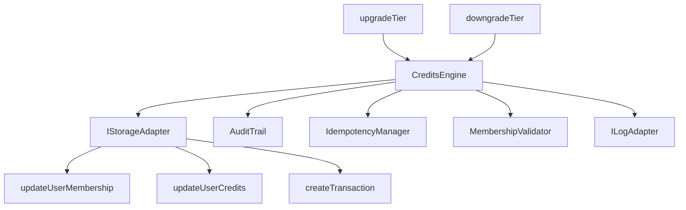
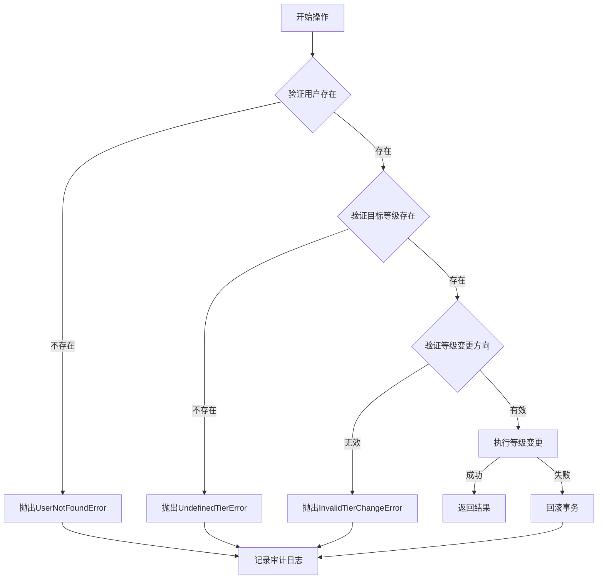

# 设计文档：会员等级管理

## 概述

本设计文档描述了积分SDK的会员等级管理功能的技术实现方案。该功能允许系统升级或降级用户的会员等级，同时自动调整用户的积分余额以匹配新等级的预设上限。

### 设计目标

1. **一致性**：与现有SDK架构保持一致，遵循相同的设计模式
2. **事务安全**：支持事务上下文，确保数据一致性
3. **可审计性**：记录所有等级变更操作
4. **幂等性**：防止重复操作
5. **可扩展性**：易于添加新的等级管理功能

## 架构

### 整体架构

会员等级管理功能将作为CreditsEngine的新方法集成到现有架构中：

```
CreditsEngine
├── charge()           # 现有：扣费操作
├── refund()           # 现有：退款操作
├── grant()            # 现有：发放积分
├── upgradeTier()      # 新增：升级会员等级
└── downgradeTier()    # 新增：降级会员等级
```

### 依赖关系



## 组件和接口

### 1. 配置扩展

扩展现有的`CreditsConfig`类型以支持积分上限配置：

```typescript
/**
 * 会员等级积分上限配置
 * 定义每个会员等级的积分上限
 */
export interface TierCreditsCapConfig {
  [tier: string]: number;
}

/**
 * 扩展的会员配置
 * 在现有MembershipConfig基础上添加积分上限
 */
export interface MembershipConfig {
  /** 会员等级层次结构 (数字越大等级越高) */
  tiers: {
    [tier: string]: number;
  };
  /** 操作所需的最低会员等级 */
  requirements: {
    [action: string]: string | null;
  };
  /** 新增：每个等级的积分上限 */
  creditsCaps: TierCreditsCapConfig;
}
```

### 2. 存储适配器接口扩展

扩展`IStorageAdapter`接口以支持会员等级更新：

```typescript
export interface IStorageAdapter {
  // ... 现有方法 ...
  
  /**
   * 更新用户会员等级和积分
   * 
   * @param userId - 用户唯一标识符
   * @param membershipTier - 新的会员等级
   * @param credits - 新的积分余额
   * @param membershipExpiresAt - 会员到期时间（可选）
   * @param txn - 可选的事务上下文
   * @returns 更新后的用户对象
   * @throws 如果用户不存在应该抛出错误
   */
  updateUserMembership(
    userId: string,
    membershipTier: string,
    credits: number,
    membershipExpiresAt?: Date | null,
    txn?: any
  ): Promise<User>;
}
```

### 3. 操作参数和结果类型

定义升级和降级操作的参数和结果类型：

```typescript
/**
 * 升级会员等级参数
 */
export interface UpgradeTierParams {
  /** 用户 ID */
  userId: string;
  /** 目标会员等级 */
  targetTier: string;
  /** 会员到期时间（可选，null表示不更新） */
  membershipExpiresAt?: Date | null;
  /** 幂等键（可选，用于防止重复操作） */
  idempotencyKey?: string;
  /** 元数据（可选，存储额外信息） */
  metadata?: Record<string, any>;
  /** 事务上下文（可选，用于事务透传） */
  txn?: any;
}

/**
 * 降级会员等级参数
 */
export interface DowngradeTierParams {
  /** 用户 ID */
  userId: string;
  /** 目标会员等级 */
  targetTier: string;
  /** 是否清除会员到期时间（可选，默认false） */
  clearExpiration?: boolean;
  /** 幂等键（可选，用于防止重复操作） */
  idempotencyKey?: string;
  /** 元数据（可选，存储额外信息） */
  metadata?: Record<string, any>;
  /** 事务上下文（可选，用于事务透传） */
  txn?: any;
}

/**
 * 等级变更结果
 */
export interface TierChangeResult {
  /** 操作是否成功 */
  success: true;
  /** 交易 ID */
  transactionId: string;
  /** 旧会员等级 */
  oldTier: string | null;
  /** 新会员等级 */
  newTier: string;
  /** 旧积分余额 */
  oldCredits: number;
  /** 新积分余额 */
  newCredits: number;
  /** 积分变动量 */
  creditsDelta: number;
}
```

### 4. 错误类型

定义新的错误类型：

```typescript
/**
 * 无效等级变更错误
 * 当尝试进行无效的等级变更时抛出
 */
export class InvalidTierChangeError extends Error {
  constructor(
    public userId: string,
    public currentTier: string | null,
    public targetTier: string,
    public reason: string
  ) {
    super(
      `Invalid tier change for user ${userId}: ${reason}. ` +
      `Current tier: ${currentTier}, Target tier: ${targetTier}`
    );
    this.name = 'InvalidTierChangeError';
  }
}

/**
 * 未定义等级错误
 * 当等级未在配置中定义时抛出
 */
export class UndefinedTierError extends Error {
  constructor(public tier: string) {
    super(`Tier '${tier}' is not defined in configuration`);
    this.name = 'UndefinedTierError';
  }
}
```

## 数据模型

### 用户模型（现有，无需修改）

```typescript
export interface User {
  id: string;
  credits: number;
  membershipTier: string | null;
  membershipExpiresAt: Date | null;
  createdAt: Date;
  updatedAt: Date;
}
```

### 交易记录（现有，无需修改）

等级变更操作将创建交易记录，action字段使用特殊值：
- `'tier-upgrade'`: 升级操作
- `'tier-downgrade'`: 降级操作

metadata字段将包含：
```typescript
{
  oldTier: string | null,
  newTier: string,
  oldCredits: number,
  newCredits: number,
  creditsDelta: number,
  membershipExpiresAt?: Date | null
}
```

## 正确性属性

*属性是一个特征或行为，应该在系统的所有有效执行中保持为真——本质上是关于系统应该做什么的形式化陈述。属性作为人类可读规范和机器可验证正确性保证之间的桥梁。*

### 属性 1: 等级变更方向验证

*对于任何*用户和目标等级，升级操作应该只在目标等级高于当前等级时成功，降级操作应该只在目标等级低于当前等级时成功

**验证需求: 1.1, 1.7, 2.1, 2.7**

### 属性 2: 等级字段更新

*对于任何*成功的等级变更操作，用户的membershipTier字段应该被更新为目标等级

**验证需求: 1.2, 2.2**

### 属性 3: 积分上限应用

*对于任何*成功的等级变更操作，用户的积分应该被设置为目标等级在配置中定义的积分上限

**验证需求: 1.3, 2.3**

### 属性 4: 交易记录创建

*对于任何*成功的等级变更操作，系统应该创建一条交易记录，记录积分变动和等级变更详情

**验证需求: 1.4, 2.4**

### 属性 5: 审计日志记录

*对于任何*等级变更操作（成功或失败），如果审计功能已启用，系统应该创建审计日志记录操作详情和结果

**验证需求: 1.5, 2.5, 7.1, 7.2, 7.3, 7.4, 7.5**

### 属性 6: 未定义等级错误处理

*对于任何*不存在于配置中的目标等级，等级变更操作应该抛出UndefinedTierError

**验证需求: 1.6, 2.6**

### 属性 7: 用户不存在错误处理

*对于任何*不存在的用户ID，等级变更操作应该抛出UserNotFoundError

**验证需求: 1.8, 2.8**

### 属性 8: 配置验证

*对于任何*SDK初始化，如果会员等级配置中的任何等级缺少积分上限定义，或积分上限为负数，系统应该抛出ConfigurationError

**验证需求: 3.2, 3.3, 3.4**

### 属性 9: 事务原子性

*对于任何*在事务上下文中执行的等级变更操作，如果操作失败，所有数据库更改（用户等级、积分、交易记录）应该被回滚

**验证需求: 4.1, 4.2, 4.3**

### 属性 10: 幂等性保证

*对于任何*带有幂等键的等级变更操作，使用相同幂等键的重复调用应该返回第一次操作的缓存结果，而不执行实际的等级变更

**验证需求: 5.1, 5.2**

### 属性 11: 会员到期时间管理

*对于任何*升级操作，如果提供了membershipExpiresAt参数，用户的到期时间应该被更新；如果未提供，到期时间应该保持不变。对于降级操作，如果clearExpiration为true，到期时间应该被清除

**验证需求: 6.1, 6.2, 6.3**

### 属性 12: 存储适配器原子更新

*对于任何*等级变更操作，存储适配器应该在单个原子操作中同时更新用户的等级和积分

**验证需求: 8.3, 8.4**

## 错误处理

### 错误类型和场景

| 错误类型 | 触发场景 | 处理方式 |
|---------|---------|---------|
| `UserNotFoundError` | 用户不存在 | 抛出错误，记录审计日志 |
| `UndefinedTierError` | 目标等级未在配置中定义 | 抛出错误，记录审计日志 |
| `InvalidTierChangeError` | 升级时目标等级不高于当前等级，或降级时目标等级不低于当前等级 | 抛出错误，记录审计日志 |
| `ConfigurationError` | 配置无效（缺少积分上限或积分上限为负数） | 在SDK初始化时抛出 |

### 错误处理流程



## 测试策略

### 双重测试方法

本功能将采用单元测试和基于属性的测试相结合的方法：

**单元测试**：
- 验证特定示例和边界情况
- 测试错误条件和异常处理
- 测试配置验证逻辑
- 测试与现有功能的集成点

**基于属性的测试**：
- 验证跨所有输入的通用属性
- 通过随机化实现全面的输入覆盖
- 每个属性测试最少运行100次迭代
- 每个测试必须引用其设计文档属性

### 测试配置

**属性测试库**: 使用`fast-check`（TypeScript的属性测试库）

**测试标签格式**: 
```typescript
// Feature: membership-tier-management, Property 1: 等级变更方向验证
```

### 测试覆盖范围

**单元测试应该关注**：
- 特定的升级和降级示例
- 边界情况（如等级相同、用户无会员等）
- 错误条件（用户不存在、等级未定义等）
- 配置验证
- 与审计日志、幂等性管理器的集成

**属性测试应该关注**：
- 属性1-12中定义的所有通用属性
- 通过随机生成的用户、等级和配置进行全面覆盖
- 事务回滚行为
- 幂等性保证

## 实现细节

### upgradeTier方法实现流程

```typescript
async upgradeTier(params: UpgradeTierParams): Promise<TierChangeResult> {
  // 1. 幂等性检查
  if (idempotencyKey) {
    const cached = await idempotencyManager.check(idempotencyKey, txn);
    if (cached) return cached.result;
  }
  
  // 2. 获取用户信息
  const user = await storage.getUserById(userId, txn);
  if (!user) throw new UserNotFoundError(userId);
  
  // 3. 验证目标等级存在
  if (!(targetTier in config.membership.tiers)) {
    throw new UndefinedTierError(targetTier);
  }
  
  // 4. 验证升级方向
  const currentLevel = user.membershipTier 
    ? config.membership.tiers[user.membershipTier] 
    : -1;
  const targetLevel = config.membership.tiers[targetTier];
  
  if (targetLevel <= currentLevel) {
    throw new InvalidTierChangeError(
      userId, 
      user.membershipTier, 
      targetTier,
      'Target tier must be higher than current tier for upgrade'
    );
  }
  
  // 5. 获取目标等级的积分上限
  const newCredits = config.membership.creditsCaps[targetTier];
  
  // 6. 更新用户等级和积分
  const balanceBefore = user.credits;
  const creditsDelta = newCredits - balanceBefore;
  
  await storage.updateUserMembership(
    userId,
    targetTier,
    newCredits,
    membershipExpiresAt,
    txn
  );
  
  // 7. 创建交易记录
  const transaction = await storage.createTransaction({
    userId,
    action: 'tier-upgrade',
    amount: creditsDelta,
    balanceBefore,
    balanceAfter: newCredits,
    metadata: {
      oldTier: user.membershipTier,
      newTier: targetTier,
      oldCredits: balanceBefore,
      newCredits,
      creditsDelta,
      membershipExpiresAt
    }
  }, txn);
  
  // 8. 创建审计日志
  if (config.audit.enabled) {
    await auditTrail.log({
      userId,
      action: 'upgradeTier',
      status: 'success',
      metadata: {
        oldTier: user.membershipTier,
        newTier: targetTier,
        oldCredits: balanceBefore,
        newCredits,
        creditsDelta,
        transactionId: transaction.id
      }
    }, txn);
  }
  
  // 9. 保存幂等记录
  const result = {
    success: true,
    transactionId: transaction.id,
    oldTier: user.membershipTier,
    newTier: targetTier,
    oldCredits: balanceBefore,
    newCredits,
    creditsDelta
  };
  
  if (idempotencyKey) {
    await idempotencyManager.save(idempotencyKey, result, txn);
  }
  
  return result;
}
```

### downgradeTier方法实现流程

downgradeTier方法的实现流程与upgradeTier类似，主要区别在于：
1. 验证目标等级低于当前等级（而不是高于）
2. action字段使用`'tier-downgrade'`
3. 支持`clearExpiration`参数来清除会员到期时间

### 配置验证增强

在CreditsEngine构造函数中添加积分上限配置验证：

```typescript
private validateConfig(config: CreditsConfig): void {
  // ... 现有验证 ...
  
  // 验证积分上限配置
  if (!config.membership.creditsCaps || 
      typeof config.membership.creditsCaps !== 'object') {
    throw new ConfigurationError(
      'Membership configuration must include creditsCaps'
    );
  }
  
  // 验证每个等级都有积分上限
  for (const tier of Object.keys(config.membership.tiers)) {
    if (!(tier in config.membership.creditsCaps)) {
      throw new ConfigurationError(
        `Missing credits cap for tier '${tier}'`
      );
    }
    
    const cap = config.membership.creditsCaps[tier];
    if (typeof cap !== 'number' || cap < 0) {
      throw new ConfigurationError(
        `Credits cap for tier '${tier}' must be a non-negative number`
      );
    }
  }
}
```

## 性能考虑

1. **数据库操作优化**：
   - 使用单个`updateUserMembership`调用同时更新等级和积分，减少数据库往返
   - 在事务中批量执行所有操作

2. **幂等性缓存**：
   - 利用现有的幂等性管理器避免重复操作
   - 配置合理的TTL以平衡内存使用和重复请求保护

3. **日志记录**：
   - 使用结构化日志记录关键操作步骤
   - 在高负载场景下可以通过配置禁用审计日志

## 向后兼容性

1. **配置扩展**：
   - 新增的`creditsCaps`字段是必需的，但只在使用新功能时才需要
   - 现有代码不使用等级管理功能时不受影响

2. **存储适配器**：
   - 新增的`updateUserMembership`方法需要所有适配器实现
   - 提供参考实现（PrismaAdapter和MockAdapter）

3. **类型定义**：
   - 所有新类型都是新增的，不修改现有类型
   - 导出所有新类型以供外部使用

## 安全考虑

1. **权限控制**：
   - 等级变更操作应该只能由授权的管理员或系统进程调用
   - 建议在应用层实现权限检查

2. **输入验证**：
   - 严格验证所有输入参数
   - 防止SQL注入（通过参数化查询）

3. **审计追踪**：
   - 记录所有等级变更操作
   - 包含足够的上下文信息用于审计

## 部署和迁移

### 数据库迁移

不需要数据库schema变更，现有的User表已包含所需字段：
- `membershipTier`
- `membershipExpiresAt`
- `credits`

### 配置迁移

现有用户需要在配置中添加`creditsCaps`：

```typescript
// 迁移前
const config = {
  membership: {
    tiers: { free: 0, pro: 1, premium: 2 },
    requirements: { ... }
  }
};

// 迁移后
const config = {
  membership: {
    tiers: { free: 0, pro: 1, premium: 2 },
    requirements: { ... },
    creditsCaps: {
      free: 100,
      pro: 1000,
      premium: 10000
    }
  }
};
```

### 适配器更新

所有自定义存储适配器需要实现新的`updateUserMembership`方法。参考实现将在PrismaAdapter和MockAdapter中提供。
